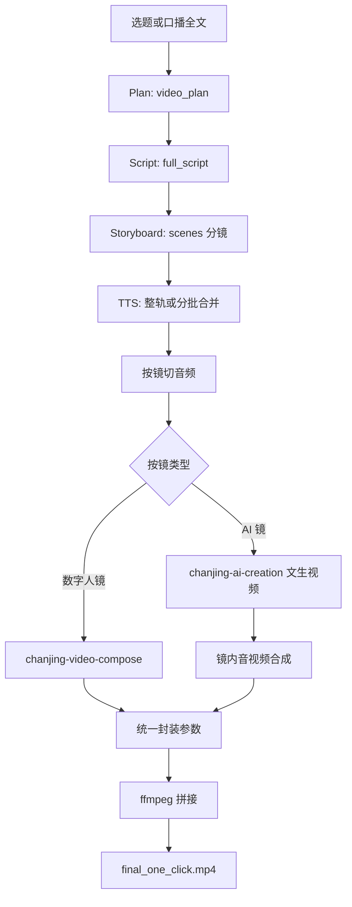

# chanjing-one-click-video-creation

## 1. 作用说明

本 skill 面向「**把选题或口播稿做成可发布的竖屏短视频**」：由 Agent（配合 `templates/` 提示词）或你自备的 `workflow.json`，串联 **蝉镜 TTS、数字人视频合成、AI 文生视频**，再经本机 **ffmpeg** 切段、对齐、拼接，得到**本地 mp4** 成片。

- **适合**：要成片、要口播 + 画面混剪（奇偶镜 / 文生提示词见 [`templates/storyboard_prompt.md`](./templates/storyboard_prompt.md)；速查 [`SKILL.md`](./SKILL.md)）。
- **不适合**：只要文案/标题、不要视频、或仅剪辑已有素材（不必走本流水线）。

细则与接口契约以 **[`SKILL.md`](./SKILL.md)** 为准（篇首**速查表**；**文生 `ref_prompt`** 条文以 **[`storyboard_prompt.md`](./templates/storyboard_prompt.md)** / **[`history_storyboard_prompt.md`](./templates/history_storyboard_prompt.md)** 为准，**§4.2** 为指针；**§5** `run_render`、**§6–§7** 输入输出）；**渲染技术规则与硬性约束**以 **[`templates/render_rules.md`](./templates/render_rules.md)** 为准（`SKILL.md` **§8** 为锚点）。

---

## 2. 文档结构与各文件作用

| 文件路径 | 作用 |
|------|------|
| **[`SKILL.md`](./SKILL.md)** | **主真值**：篇首**速查表**；§4.1 工作流；**`ref_prompt`** 在 **`storyboard_prompt.md`** / **`history_storyboard_prompt.md`**（§4.2 指针）；§5 `run_render`；§6–§7；§8 硬约束；§9 限制。**渲染正文**见 `render_rules.md`（§1–§4；`SKILL.md` §7、§8 为摘要/锚点）。 |
| **`README.md`（本文件）** | 人类阅读入口：作用、速查与流程图、环境与命令、测试与 FAQ；**不重复**写规则条文。 |
| **`templates/*.md`** | Plan / Script / **文生 `ref_prompt` 真值**（`storyboard_prompt.md`、`history_storyboard_prompt.md`）/ 族裔约束 / **渲染规则**（`render_rules.md`）等；**渲染实现**与 `render_rules.md` 冲突时以 `render_rules.md` 为准。 |
| **`scripts/run_render.py`** | **确定性成片**：读 `workflow.json`，调子 skill（TTS、video-compose、ai-creation），写 `work/` 与 `final_one_click.mp4`；行为须符合 **`render_rules.md`**、**`SKILL.md` §5**。 |
| **`examples/workflow-input.example.json`** | `run_render` 输入结构示例，字段含义对照 `SKILL.md` §5（输入 MVP）。 |
| **`tests/`** | 桩测试与测试用 ID 解析（可选 `chanjing_test_defaults.json`，**不**写 `.chanjing_test_ids.json` 缓存）；保障脚本与 JSON 结构，**不**承载业务规则。 |

### 模板模板（templates/）文件简介

| 文件路径 | 作用（主要角色） |
|----------|-----------------|
| **templates/video_brief_plan.md** | 视频策划结构 JSON 约束模板，要求 Agent 输出标准化 `video_plan` 字段结构（如 scene_count、core_angle、场景等）。|
| **templates/script_prompt.md** | 口播文案创作提示词模板：据策划输出口播全文（含 hook/正文/CTA），口语化风格和结构详细要求都在此定义。|
| **templates/storyboard_prompt.md** | 分镜切段与奇偶镜、`scenes[]` 字段；当代画面 7 要素与 D.1b checklist，为每镜 `visual_prompt` / `ref_prompt` 奠基。 |
| **templates/history_storyboard_prompt.md** | 非当代/纪传/历史分镜模板：适配历史/非当代题材，突出时代/文明圈准确性与细节自洽。|
| **templates/visual_prompt_people_constraint.md** | 文生视频人物与族裔：**触发条件**下须在 `ref_prompt` 显式写入族裔锚定（本 skill 文档化的默认 profile 见该文件）；含身份动作刻画与推荐英文短语。|
| **templates/render_rules.md** | 渲染阶段唯一细则：技术规则（TTS/切段/数字人/AI/ffmpeg）、硬性约束、Render/成功状态与输出约定；`ref_prompt` 质检配合 **`storyboard_prompt.md`** / **`history_storyboard_prompt.md`**。|
| **templates/rewrite_hook_prompt.md** | Hook 优化提示词模板：可选，用于将初稿 hook 强化冲突感或反常识/代入感（便于算法抓取）。|

---

## 3. 业务逻辑与技术方案

### 3.1 逻辑概要

端到端可分为两层：

1. **内容层（Agent 或人工）**：输入选题或口播全文 → 产出 **`video_plan`**、**`full_script`**、**`scenes[]` 分镜**（含每镜类型：数字人口播 / AI 画面、文案与 `ref_prompt` 等）。模板见 `templates/`；编排见 `SKILL.md` §4.1；**`ref_prompt`** 见 **`storyboard_prompt.md`** / **`history_storyboard_prompt.md`**；**切段与奇偶镜**见 **`storyboard_prompt.md`** 篇首；**镜数**见 **`video_brief_plan.md`**。
2. **渲染层**：对已定稿口播做 **TTS**（过长则按分镜合并少批次）→ **按镜切音频** → 数字人镜走 **video-compose（音频驱动）**，AI 镜走 **文生视频 + 与镜内音频合成** → 按公共数字人轨统一分辨率/帧率等 → **ffmpeg 顺序拼接** → 输出 **`final_one_click.mp4`** 与 **`workflow_result.json`**。细则见 **`templates/render_rules.md`**。

既可由 Agent **分步**调用各蝉镜 skill，也可在已有 `workflow.json` 时**只跑** `run_render.py`（见下节「环境与运行」）。

### 3.2 流程图

---

## 4. 数字人与音色（无环境变量默认）

`run_render.py` **不会**从环境变量读取默认音色、数字人 `person_id` 或 `figure_type`。每次成片须在 **`workflow.json` 根级**写明 **`audio_man`**、存在数字人镜时的 **`person_id`**（或 `avatar_id`）与 **`figure_type`**。请按当次 **`video_plan`** 与口播人设，调用 **`list_voices`** 与 **`list_figures`**（`--source` 与任务一致，如公共或定制），将返回的 ID 填入；勿依赖 shell/`export` 或仓库内跨任务的隐式「默认」记录。

---
